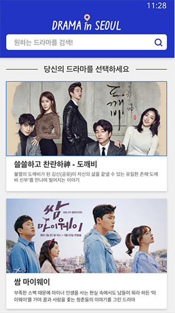
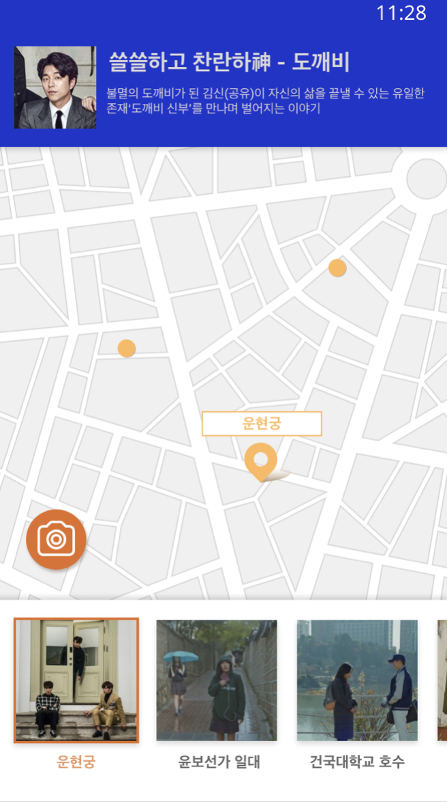
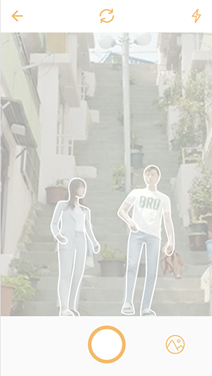
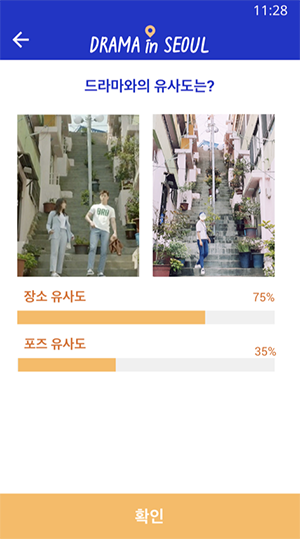

 # 2018년 서울시 앱 공모전 출품작
 # (드라마 인 서울 [DramaInSeoul(logo)])

  
  
  
# 팀명 "씬스틸러" 
# 앱명 "드라마 인 서울" - Android App

- ### 개요

 서울의 드라마 명소를 찾아주고 드라마 장면 포즈에 맞게 사진필터를 제공해주는 모바일 앱

- ### 검색 서비스
 
 원하는 드라마를 검색을 통해 제공하며, 서울에서 촬영된 다양한 드라마 정보를 볼 수 있다. 
 
   

- ### 드라마 GoogleMapAPI 위치 정보 서비스
 
 ① 드라마 촬영 장소를 구글맵을 통해 제공
 ② 하단의 이미지를 좌우로 넘겨가며,드라마 명소 선택 가능
 ③ 하단의 이미지를 1번 터치시 구글 맵 위치 이동, 2번 터치 필터 페이지로 이동.  
 
   

 
- ### 명장면 필터 및 가이드 라인 제공
  ① 필터의 가이드라인에 맞춰 사진을 촬영
  ② 하단의 갤러리 버튼을 눌러 본인이 찍은 사진을 확인 

 
   

- ### 배경 및 포즈 유사도 비교 및 결과 제공 서비스 

  ① 본인이 찍은 사진과 드라마 장면 원본의 포즈의 유사도 정보를 제공
  ② 배경의 유사도를 제공
  ③ ‘Okey’ 버튼을 통해 처음으로 이동

   

- # 개발 & 디자인 환경

* os - Window,Mac
* Android Studio
* FireBase DataBase, Amazon Web Services 
* OpenCV - Background/Pose
* Adobe illustrator
* Zeplin
